<div align="center">

# paper2pod — Paper To Podcast Pipeline

**paper2pod is a Python pipeline that changes an arXiv paper into a multi-voice podcast. It takes a paper reference through these steps to a WAV file and a quality report:**

`fetch` → `parse` → `outline` → `script` → `validate` → `tts` → `mix`.


**[Summary](#1-summary)** ·
**[Workflow](#4-the-end-to-end-workflow)** ·
**[Run it](#16-how-to-run-paper2pod)** ·
**[Configuration](#164-environment-variables)** ·
**[Known problems](#19-known-problems)** ·
**[Glossary](#21-glossary)**

</div>

> [!NOTE]
> This README uses ASD-STE100 Simplified Technical English. The writing rules and the project
> vocabulary are in [`docs/ste-style-guide.md`](docs/ste-style-guide.md). Each term in the
> [Glossary](#21-glossary) has only one meaning.

---

paper2pod reads an arXiv paper and makes a podcast in which two to four speakers explain the paper.
The main idea is control. A word budget sets the length, a JSON schema sets the format of each turn,
and a lexical check compares the numbers and acronyms of the script with the paper. The core
package needs only the Python standard library. All external services are optional adapters, and a
fake backend runs the full pipeline offline.

This README is the **one location that explains all of paper2pod**. It gives these topics:

- the general design
- each stage and each front-end, and its procedure, step by step
- the length control and the safety model
- the data map
- the runbook
- the validation results and the known problems

| If you are… | Read |
|---|---|
| A manager or reviewer | [1](#1-summary), [3](#3-design-rules), [4](#4-the-end-to-end-workflow), [18](#18-validation-results), [20](#20-key-points) |
| A developer who joins the project | All sections, in sequence. Keep [16](#16-how-to-run-paper2pod) and [19](#19-known-problems) open while you work |
| An operator who runs paper2pod | [16](#16-how-to-run-paper2pod), [13](#13-the-front-ends), then the section for the stage that you examine |

---

## Table of contents

1. 🧭 [Summary](#1-summary)
2. 🏗️ [How paper2pod is built](#2-how-paper2pod-is-built)
   - 2.1 [Components](#21-components)
   - 2.2 [System context](#22-system-context)
   - 2.3 [Repository layout](#23-repository-layout)
3. 🛡️ [Design rules](#3-design-rules)
4. 🔄 [The end-to-end workflow](#4-the-end-to-end-workflow)
   - 4.1 [Full flow](#41-full-flow)
   - 4.2 [The life cycle of one job](#42-the-life-cycle-of-one-job)
   - 4.3 [Who does which step](#43-who-does-which-step)
5. 🔵 [The fetch stage](#5-the-fetch-stage)
6. 🟢 [The parse stage](#6-the-parse-stage)
7. 🟣 [The outline stage](#7-the-outline-stage)
8. 🟠 [The script stage](#8-the-script-stage)
9. 🟡 [The validate stage](#9-the-validate-stage)
10. 🔴 [The TTS stage](#10-the-tts-stage)
11. 🟤 [The mix stage](#11-the-mix-stage)
12. 🧵 [The job runner](#12-the-job-runner)
13. 🖥️ [The front-ends](#13-the-front-ends)
    - 13.1 [The CLI](#131-the-cli) · 13.2 [The HTTP API](#132-the-http-api) · 13.3 [The Streamlit UI](#133-the-streamlit-ui) · 13.4 [The chat session](#134-the-chat-session)
14. ⚖️ [The length control and the safety model](#14-the-length-control-and-the-safety-model)
15. 🗂️ [Data and file map](#15-data-and-file-map)
16. ▶️ [How to run paper2pod](#16-how-to-run-paper2pod)
    - 16.1 [Prerequisites](#161-prerequisites) · 16.2 [Installation](#162-installation) · 16.3 [Run paper2pod](#163-run-paper2pod) · 16.4 [Environment variables](#164-environment-variables)
17. 🧩 [How to extend paper2pod](#17-how-to-extend-paper2pod)
18. ✅ [Validation results](#18-validation-results)
19. ⚠️ [Known problems](#19-known-problems)
20. 📌 [Key points](#20-key-points)
21. 📖 [Glossary](#21-glossary)
22. 📄 [License](#22-license)

---

## 1. Summary

**The problem.** An LLM can write a podcast about a paper, but the result is often too short, badly
formatted or not true to the paper. These are the difficult questions:

- How do you read the full paper, and not only its first characters?
- How do you get a podcast of the requested length?
- How do you keep the spoken text clean, with a distinct voice for each speaker?
- How do you find numbers and acronyms that the LLM invented?
- How do you run long jobs without a blocked UI or shared output files?

paper2pod gives each of these questions its own stage or component. Each stage is a plain function
call with injected adapters, so the tests run each stage without a network.

| Item | Value |
|---|---|
| Input | A paper reference (`1706.03762`, `2401.01234v2`, `hep-th/9901001` or an arXiv URL), a length of 2 to 60 minutes and 2 to 4 speakers |
| Output | `podcast.wav` (optional `podcast.mp3`), `script.json`, `chapters.json` and `metrics.json` in one job directory |
| Stages | **7**: `fetch`, `parse`, `outline`, `script`, `validate`, `tts`, `mix` |
| Front-ends | **4**: the CLI (5 commands), the HTTP API (7 routes), the Streamlit UI and the chat session |
| Providers | arXiv Atom API for papers. OpenAI chat completions and OpenAI speech, both optional |
| Offline mode | `paper2pod demo` runs all 7 stages on the sample paper with `FakeLLM` and `FakeTTS`. It needs no key and no network |
| Safety | The LLM returns JSON that must match a strict schema. Only known speakers are accepted. Credentials come only from the environment |
| Tests | **92** unit and end-to-end tests (`pytest`), all offline |


---

## 2. How paper2pod is built

### 2.1 Components

| Component | Module | Purpose |
|---|---|---|
| Settings | `src/paper2pod/config.py` | Read and validate the 15 environment variables. Load `.env` if it exists |
| Data objects | `src/paper2pod/models.py` | `Paper`, `Section`, `Speaker`, `Turn`, `Script`, `PodcastRequest` |
| Paper sources | `src/paper2pod/sources/arxiv.py`, `local.py`, `base.py` | Search, resolve and fetch papers, with a cache and a rate limit |
| PDF and text parser | `src/paper2pod/parsing/pdf.py`, `cleaning.py`, `sections.py` | Extract the PDF text in reading sequence, clean it and split it into sections |
| Outline builder | `src/paper2pod/script/outline.py` | Group the sections and summarize each group with the LLM |
| Budget planner | `src/paper2pod/script/budget.py` | Divide the word budget into segment plans with token limits |
| Script writer | `src/paper2pod/script/generate.py` | Write each segment as JSON turns, regenerate or trim it |
| Prompt templates | `src/paper2pod/prompts/*.txt`, `script/prompts.py` | Four versioned prompt templates, loaded as package data |
| Quality checks | `src/paper2pod/quality/` | Length, format, grounding and readability checks |
| Audio tools | `src/paper2pod/audio/voices.py`, `text.py`, `mix.py` | Voice assignment, TTS chunks, loudness, pauses, chapters, WAV and MP3 |
| Service adapters | `src/paper2pod/services/llm.py`, `tts.py`, `fakes.py`, `factory.py` | OpenAI adapters, offline fakes and the factory that selects them |
| Retry policy | `src/paper2pod/retry.py` | Exponential backoff for transient errors |
| Pipeline | `src/paper2pod/pipeline.py` | Run the 7 stages in sequence and write all files to the job directory |
| Job store and job runner | `src/paper2pod/jobs.py` | Keep one `job.json` for each job. Run jobs on a thread pool, with progress and cancel |
| Runtime wiring | `src/paper2pod/runtime.py` | Build the pipeline and the job runner from the settings |
| CLI | `src/paper2pod/cli.py` | The `paper2pod` command with 5 subcommands |
| HTTP API | `src/paper2pod/api.py` | The FastAPI job service |
| Streamlit UI | `src/paper2pod/ui/streamlit_app.py` | Search, chat and job panels in a browser |
| Chat session | `src/paper2pod/chat.py` | Rule-based intents and a bounded memory for each session |

The component map shows which component calls which component.

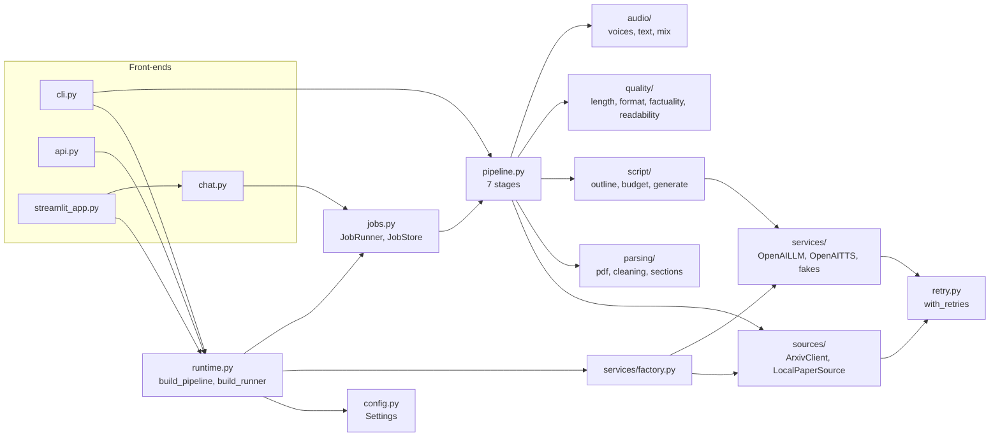

### 2.2 System context

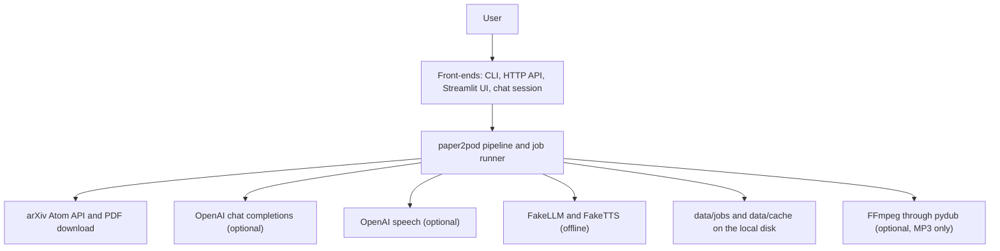

### 2.3 Repository layout

```
paper2pod/
├── .github/workflows/ci.yml     # CI: pip install -e ".[dev]" and pytest -q on Python 3.11
├── docs/ste-style-guide.md      # ASD-STE100 rules and the project vocabulary
├── src/paper2pod/
│   ├── config.py                # Settings from the environment, .env is optional
│   ├── models.py                # Data objects that the stages exchange
│   ├── errors.py                # Paper2PodError and its 6 subclasses
│   ├── retry.py                 # with_retries(): exponential backoff
│   ├── text_utils.py            # word count, sentence split, markup strip, word truncation
│   ├── pipeline.py              # The 7 stages
│   ├── jobs.py                  # JobStore and JobRunner
│   ├── runtime.py               # build_pipeline(), build_runner(), configure_logging()
│   ├── cli.py                   # paper2pod {search,make,demo,serve,ui}
│   ├── api.py                   # FastAPI app and app_from_env()
│   ├── chat.py                  # ChatSession, ConversationMemory, parse_intent()
│   ├── sources/                 # arxiv.py, local.py, base.py
│   ├── parsing/                 # pdf.py, cleaning.py, sections.py
│   ├── script/                  # outline.py, budget.py, generate.py, prompts.py
│   ├── prompts/                 # segment_system.txt, segment_user.txt, summarize_*.txt
│   ├── quality/                 # length.py, format.py, factuality.py, readability.py
│   ├── audio/                   # voices.py, text.py, mix.py
│   ├── services/                # llm.py, tts.py, fakes.py, factory.py
│   ├── ui/streamlit_app.py      # Streamlit UI
│   └── demo/sample_paper.txt    # The fictional sample paper for the offline demo
├── tests/                       # 11 test files, 92 tests, no network
├── .env.example                 # The 15 variable names, with empty values
├── pyproject.toml               # Package metadata, 10 optional extras, pytest settings
└── LICENSE                      # MIT
```

---

## 3. Design rules

### 3.1 Plain functions, not agent tools
Each stage is a method call in `Pipeline.run()` (`pipeline.py`). The pipeline gets its paper source,
LLM and TTS engine as arguments. No stage calls another stage through an LLM tool call. This makes
each stage testable with a fake adapter.

### 3.2 One job, one directory
Each job writes all of its files to `data/jobs/<job_id>/` (`jobs.py`). The job ID is a 32-character
hex UUID. `JobStore.workdir()` refuses any other ID, so a request cannot write outside the jobs folder.
Two jobs never share an output file.

### 3.3 Length from a word budget
The requested minutes become a word budget: `minutes × PAPER2POD_WORDS_PER_MINUTE` (`script/budget.py`).
Each segment gets its own share and its own token limit. The script writer regenerates a segment that
misses its range and trims a segment that is too long. The mix stage measures the real duration of the
WAV file.

### 3.4 Structured turns
The LLM returns `{"turns": [{"speaker", "text", "direction"}]}` through a strict JSON schema
(`script/generate.py`). Delivery hints go to `direction`, so paper2pod does not delete text with a
regular expression. Text in parentheses, for example `(BERT)`, stays in the spoken text.

### 3.5 Optional dependencies
The core package has no third-party dependency (`dependencies = []` in `pyproject.toml`). PDF
extraction, OpenAI, MP3 export, numpy, FastAPI, Streamlit and python-dotenv are extras. A missing extra
causes a `MissingDependency` error with the correct `pip install` command.

### 3.6 Credentials only in the environment
`OPENAI_API_KEY` comes only from the environment or from a local `.env` file (`config.py`). The
`Settings` object hides the key in its `repr`. Log messages contain token counts and stage names,
but no paper text and no script text.

### 3.7 One retry policy
`with_retries()` (`retry.py`) is the only retry policy. The OpenAI SDK retries are set to `0`.
Only a `TransientError` causes a retry: HTTP 429, HTTP 5xx, a timeout or a connection error.
All other errors stop the job at once.

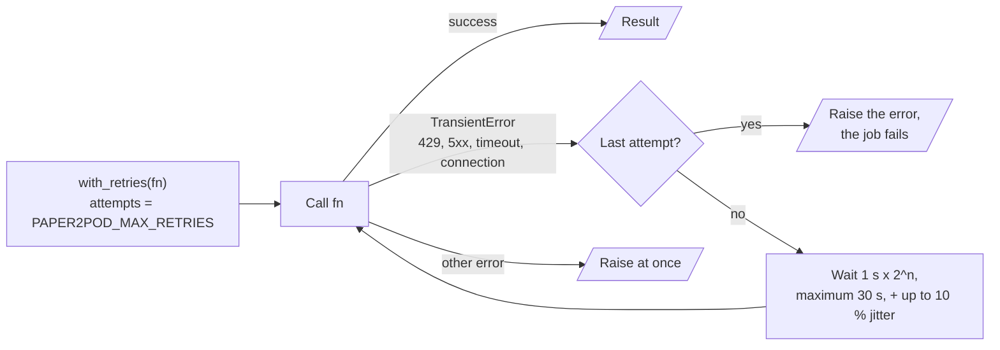

---

## 4. The end-to-end workflow

### 4.1 Full flow

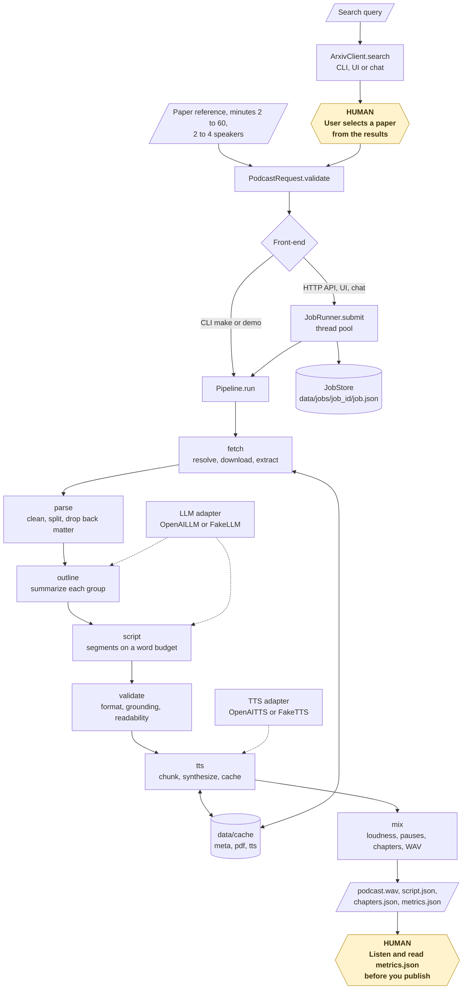

The CLI runs the pipeline in its own process and does not use the job runner. The HTTP API, the
Streamlit UI and the chat session submit jobs to the job runner and poll the job store.

### 4.2 The life cycle of one job

The diagram uses the real `JobStatus` values and the real stage names of `Pipeline.run`.

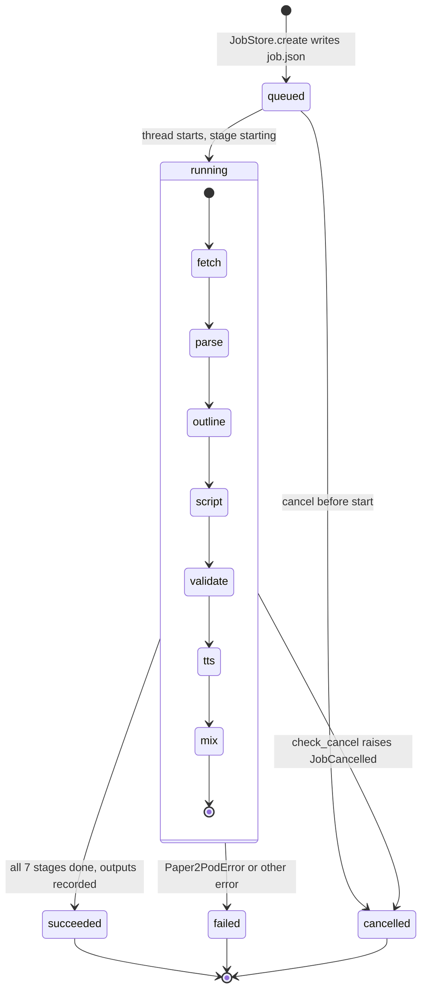

1. A front-end makes a `PodcastRequest` and calls `validate()`. The request needs a paper reference, 2 to 60 minutes and 2 to 4 unique speaker names.
2. The job store makes the job directory and writes `job.json` with the status `queued`.
3. The job runner (or the CLI) sets the status to `running`.
4. The fetch stage resolves the paper and gets its full text (0 % to 8 %).
5. The parse stage makes the sections (8 % to 12 %).
6. The outline stage summarizes each group of sections (12 % to 30 %).
7. The script stage writes each segment (30 % to 60 %).
8. The validate stage checks the script (60 % to 63 %).
9. The TTS stage synthesizes each turn (63 % to 96 %).
10. The mix stage writes `podcast.wav`, `chapters.json` and `metrics.json` (96 % to 100 %).
11. The job ends with the status `succeeded`, `failed` or `cancelled`.

Before each stage, segment, outline chunk and TTS turn, the pipeline calls `check_cancel()`. A cancel
request stops the job at the next of these points.

### 4.3 Who does which step

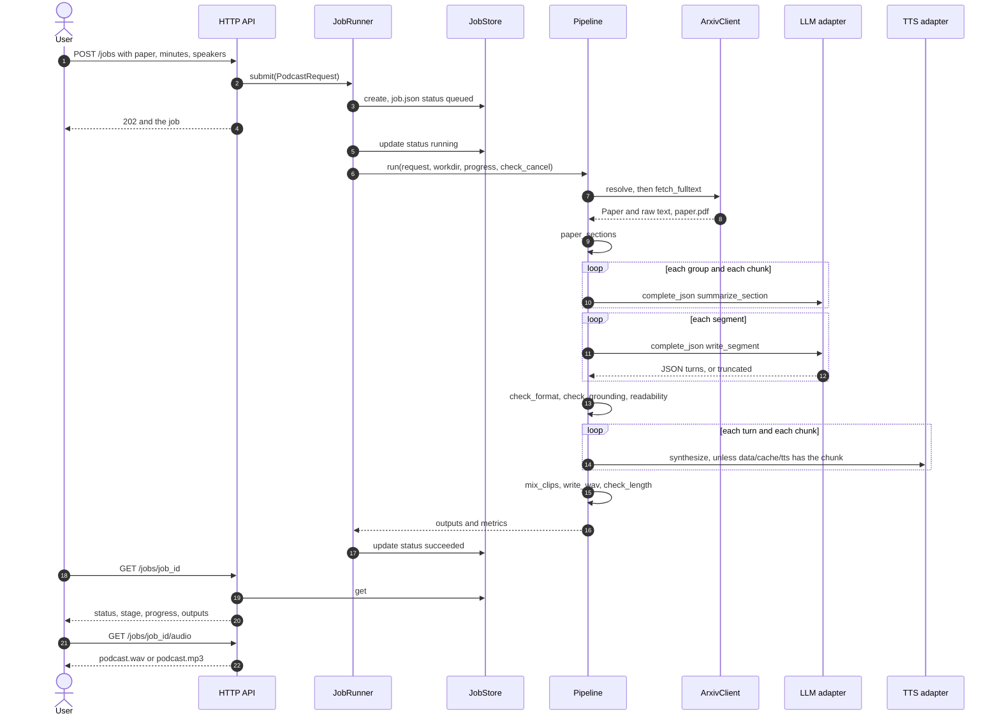

---

## 5. The fetch stage

**Purpose.** Change a paper reference into paper metadata and the raw full text of the paper.

| Input | Output |
|---|---|
| A paper reference, or `demo` for the sample paper | A `Paper` object (`arxiv_id`, `title`, `authors`, `abstract`, `pdf_url`, `published`) and the raw text |
| The cache in `data/cache/meta/` and `data/cache/pdf/` | `paper.json` and `paper.pdf` in the job directory |

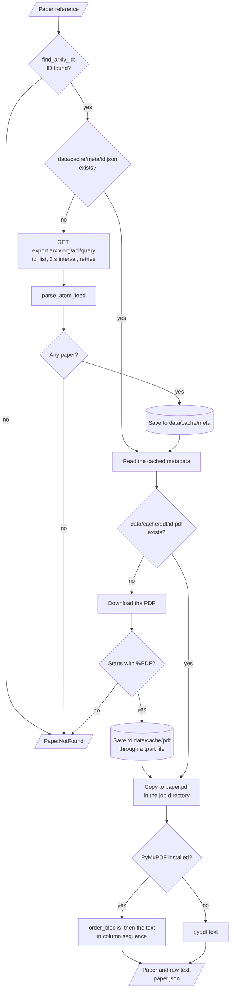

**Procedure** (`ArxivClient` in `sources/arxiv.py`)

1. Find the first arXiv ID in the reference. The ID can be new style (`1706.03762`) or old style (`hep-th/9901001`). The version suffix is removed.
2. If there is no ID, stop with `PaperNotFound`.
3. If `data/cache/meta/<id>.json` exists, read the metadata from it.
4. Otherwise, request `https://export.arxiv.org/api/query?id_list=<id>` and parse the Atom feed. Save the metadata to the cache.
5. If `data/cache/pdf/<id>.pdf` does not exist, download the PDF. Refuse the download if it does not start with `%PDF`.
6. Copy the PDF to `paper.pdf` in the job directory.
7. Extract the text with PyMuPDF. If PyMuPDF is not installed, use pypdf.
8. Write `paper.json`.

**Search procedure** (`paper2pod search`, `GET /papers/search`, the UI and the chat session)

1. If the query contains an arXiv ID and at most 6 other words, resolve that ID and return it.
2. Otherwise, send `search_query=all:<query>` with `sortBy=relevance` and 1 to 50 results.

**Rules**

- paper2pod waits at least 3 seconds between two arXiv API calls (`min_interval`). A lock makes this true for all threads.
- Each request sends the user agent `paper2pod/0.1 (+https://github.com/KrishnaAnnavaram/paper2pod)`.
- HTTP 429, HTTP 5xx, timeouts and connection errors are transient. paper2pod retries them. HTTP 404 causes `PaperNotFound`.
- PyMuPDF puts the text blocks in reading sequence. A block wider than 60 % of the page is a separator. Between two separators, paper2pod reads the left column before the right column.
- pypdf does not do this column sequence.
- `LocalPaperSource` (`sources/local.py`) serves the sample paper for every reference and every query. It uses no network.

---

## 6. The parse stage

**Purpose.** Change the raw text into clean sections without the back matter.

| Input | Output |
|---|---|
| The raw text of the paper | A list of `Section` objects (title and text) |
| | `sections.json` (title and word count of each section) |

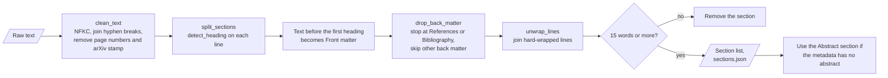

**Procedure** (`paper_sections()` in `parsing/sections.py`)

1. Apply NFKC normalization. This changes ligatures such as `fi` into `fi`.
2. Join words that a hyphen split across two lines (`repre-\nsentation`).
3. Remove lines that contain only a page number and the vertical arXiv stamp line.
4. Find the headings and split the text at each heading. Text before the first heading becomes the section `Front matter`.
5. Remove the back matter. Stop at `References` or `Bibliography`. Skip acknowledgements, appendices, supplementary material and checklists.
6. Join the hard-wrapped lines of each paragraph.
7. Remove sections with fewer than 15 words.
8. If the metadata has no abstract, use the text of the `Abstract` section.

**Rules**

- A heading is one of these:
  - a known heading such as `Abstract`, `Related Work` or `Conclusion`, with or without a colon
  - `Appendix` with an optional letter or number
  - a numbered heading such as `3.2 Pruning Rule`, `IV. RESULTS` or `A. PROOFS`
- A numbered heading title starts with a capital letter and has 1 to 9 words. It has no end punctuation, no decimal number, no URL and none of the characters `= < > { } [ ] | @ % $`.
- A single-letter number (`A.`) is a heading only for an all-capitals title or a title that starts with `Proof`, `Proofs`, `Extra`, `Additional` or `Details`. This rule stops matches on initials such as `A. Smith`.

---

## 7. The outline stage

**Purpose.** Make a short summary of every part of the paper, so that the script uses the full paper.

| Input | Output |
|---|---|
| The paper and its sections | A list of up to 8 `OutlineItem` objects (title, summary, key points, weight) |
| The LLM | `outline.json` |

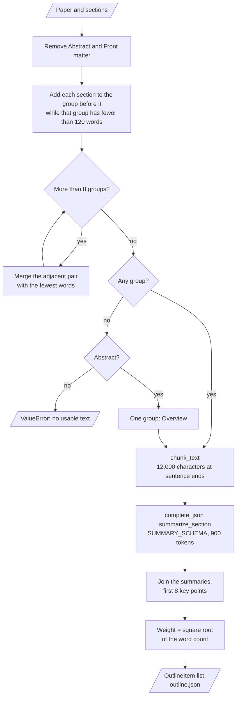

**Procedure** (`build_outline()` in `script/outline.py`)

1. Remove the `Abstract` and `Front matter` sections from the list.
2. Add each section to the group before it while that group has fewer than 120 words.
3. While there are more than 8 groups, merge the two adjacent groups with the smallest total word count.
4. If there is no group, use the abstract as one group with the title `Overview`. If there is no abstract, stop with an error.
5. Split each group into chunks of at most 12,000 characters at sentence ends.
6. Send each chunk to the LLM with the task `summarize_section`. Ask for at most 140 words and 3 to 6 key points.
7. Join the chunk summaries. Keep the first 8 key points.
8. Set the weight of the item to the square root of its word count.

**Rules**

- The LLM must return `{"summary": str, "key_points": [str]}` (`SUMMARY_SCHEMA`).
- The token limit for a summary call is 900 tokens.
- The prompt tells the LLM to copy numbers exactly and to add no facts.

---

## 8. The script stage

**Purpose.** Write a dialogue whose word count matches the word budget of the requested length.

| Input | Output |
|---|---|
| The paper, the outline, the speakers and the minutes | A `Script` (title, speakers, turns, segment titles) |
| The LLM | One `SegmentReport` for each segment, and `script.json` |

**Procedure: plan the segments** (`plan_segments()` in `script/budget.py`)

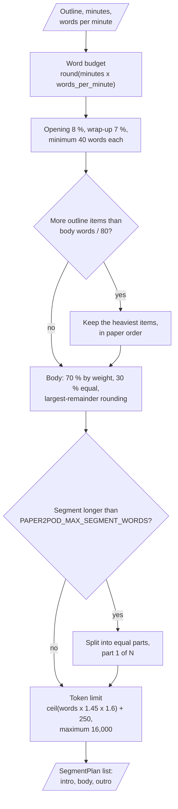

1. Calculate the word budget: `round(minutes × words_per_minute)`.
2. Give the opening 8 % and the wrap-up 7 % of the budget, with a minimum of 40 words each.
3. If the body budget is too small for all outline items, keep the heaviest items. The maximum is one item for each 80 body words.
4. Divide the body budget: 70 % by weight and 30 % in equal shares. Largest-remainder rounding makes the sum exact.
5. Split each segment that is longer than `PAPER2POD_MAX_SEGMENT_WORDS` into equal parts, for example `Results (part 1 of 2)`.
6. Give each segment a token limit: `ceil(words × 1.45 × 1.6) + 250`, with a maximum of 16,000.

**Procedure: write one segment** (`ScriptWriter.write_segment()` in `script/generate.py`)

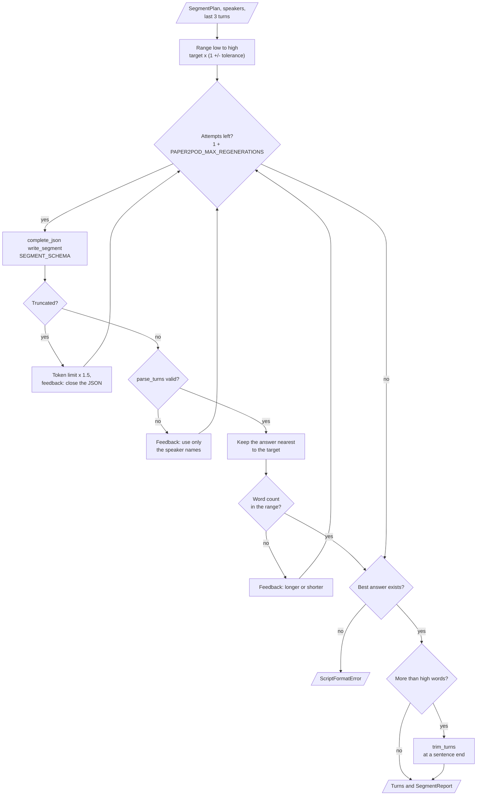

1. Calculate the range: `low = floor(target × (1 − tolerance))` and `high = ceil(target × (1 + tolerance))`.
2. Send the segment prompt to the LLM with the task `write_segment`. The prompt contains the notes, the speakers and the last 3 turns, each cut to 80 words.
3. If the answer is truncated, multiply the token limit by 1.5 and try again with feedback.
4. If the answer is not valid, try again with feedback that lists the speaker names.
5. Keep the valid answer whose word count is nearest to the target.
6. If the word count is in the range, stop. Otherwise, regenerate with feedback ("longer" or "shorter").
7. After `1 + PAPER2POD_MAX_REGENERATIONS` attempts, use the best answer. If there is no valid answer, stop with `ScriptFormatError`.
8. If the best answer has more than `high` words, trim it at a sentence end.

**Rules**

- Each turn must name a known speaker. The name match ignores case and removes `*`, `:` and `_` around the name.
- `strip_markup()` removes a `Name:` label, markdown emphasis, heading marks and list marks from the text.
- A bracketed cue such as `[laughs]` or `[pause]` moves from the text to `direction`. Parentheses stay.
- The trim keeps whole turns. It cuts the last turn at a sentence end only if at least 6 words fit.
- The segment kinds are `intro`, `body` and `outro`. Each kind has its own position note in the prompt.

---

## 9. The validate stage

**Purpose.** Measure the quality of the script and record the results in `metrics.json`.

| Input | Output |
|---|---|
| The script | `format_issues` (a list of text messages) |
| The paper text (title, abstract and sections) | `grounding` (score and unsupported sentences) and `readability` |

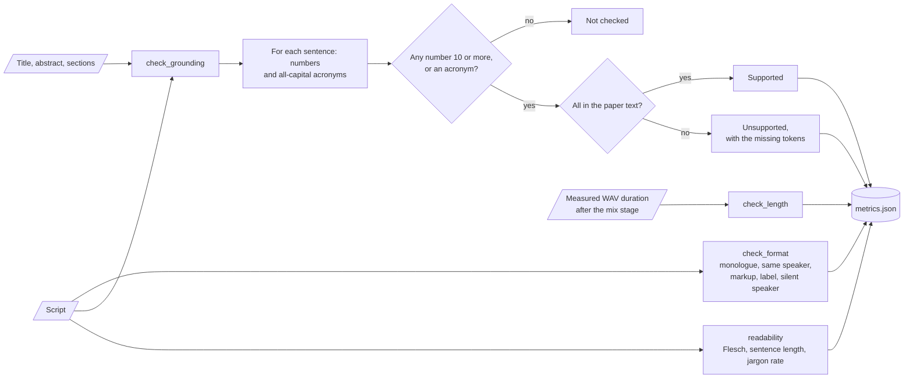

**Procedure** (`quality/`)

1. Run `check_format()`. Record each format issue.
2. Run `check_grounding()`. Find the numbers and acronyms in each sentence of each turn.
3. Mark a sentence as unsupported if one of its numbers or acronyms is not in the paper text.
4. Calculate the grounding score: supported sentences divided by checked sentences.
5. Run `readability()`. Calculate the Flesch reading ease, the mean sentence length and the jargon rate.
6. After the mix stage, run `check_length()` with the measured audio duration.

**Rules**

- The validate stage records problems. It does not stop the job and it does not change the script.
- The grounding check ignores integers below 10 and these acronyms: `I`, `OK`, `AI`, `US`, `UK`, `TV`, `FAQ`, `PHD`, `PDF`, `Q`, `A`.
- `1,000` and `1000` are equal. `95 percent` and `95%` are equal.
- An acronym must be all capitals. A mixed form such as `LLMs` is not an acronym, so the check ignores it.
- If no sentence has a number or an acronym, the grounding score is `1.0`.

---

## 10. The TTS stage

**Purpose.** Change each turn into PCM audio with the voice of its speaker.

| Input | Output |
|---|---|
| The script and the speakers | One PCM clip for each turn |
| `PAPER2POD_VOICES` | The voice map in `metrics.json` (`voices`) |

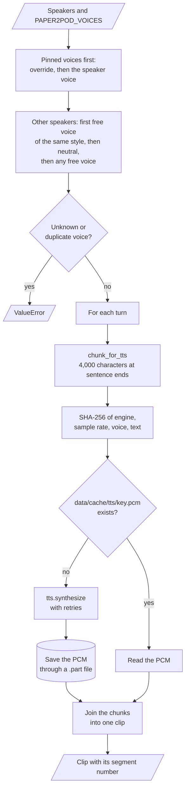

**Procedure** (`pipeline.py`, `audio/voices.py`, `audio/text.py`)

1. Assign the voices. First use the `PAPER2POD_VOICES` overrides, then the `voice` field of each speaker.
2. For each other speaker, take the first free voice with the same voice style, then a neutral voice, then any free voice.
3. Split the text of each turn into chunks of at most 4,000 characters at sentence ends.
4. For each chunk, calculate the SHA-256 key of the engine name, sample rate, voice and text.
5. If `data/cache/tts/<key>.pcm` exists, read it. Otherwise, synthesize the chunk and save it to the cache.
6. Join the chunks of one turn into one clip.

**Voice catalog** (`OPENAI_VOICES`)

| Voice | Voice style |
|---|---|
| `onyx`, `echo` | `male` |
| `nova`, `shimmer` | `female` |
| `alloy`, `fable` | `neutral` |

**Rules**

- Two speakers never get the same voice. A duplicate or an unknown voice name causes a `ValueError`.
- `OpenAITTS` requests raw PCM at 24 kHz, 16-bit, mono.
- `FakeTTS` writes a sine tone at 8 kHz. Each voice has its own frequency, and the duration follows the word count at `PAPER2POD_WORDS_PER_MINUTE`.
- A long sentence that does not fit one chunk is split at word boundaries. No word is lost.

---

## 11. The mix stage

**Purpose.** Join the clips into one podcast with even loudness, pauses and chapters.

| Input | Output |
|---|---|
| The clips, with their segment numbers | `podcast.wav` (16-bit mono PCM) |
| The segment titles and `PAPER2POD_PAUSE_MS` | `chapters.json`, optional `podcast.mp3`, and `metrics.json` |

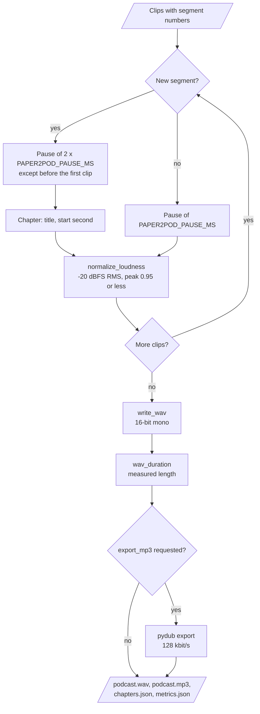

**Procedure** (`audio/mix.py`)

1. Normalize each clip to −20 dBFS RMS. The gain never lets the peak go above 0.95 of full scale.
2. Put a pause of `PAPER2POD_PAUSE_MS` between two turns of one segment.
3. Put a pause of two times `PAPER2POD_PAUSE_MS` between two segments.
4. Record one chapter (title and start second) at the start of each segment.
5. Write `podcast.wav` with the sample rate of the TTS engine.
6. Read the WAV header again and calculate the measured duration.
7. If the request asks for MP3, export `podcast.mp3` at 128 kbit/s with pydub.
8. Write `chapters.json` and `metrics.json`.

**Rules**

- If numpy is installed (`[fast]` extra), the loudness calculation uses numpy. Otherwise it uses the standard library.
- MP3 export needs the `[mp3]` extra and FFmpeg on `PATH`.

---

## 12. The job runner

**Purpose.** Run jobs in the background, so that a front-end can submit a job and return at once.

| Input | Output |
|---|---|
| A `PodcastRequest` | A `Job` with an ID, a status, a stage, a progress value, a message, an error and outputs |
| | `data/jobs/<job_id>/job.json` |

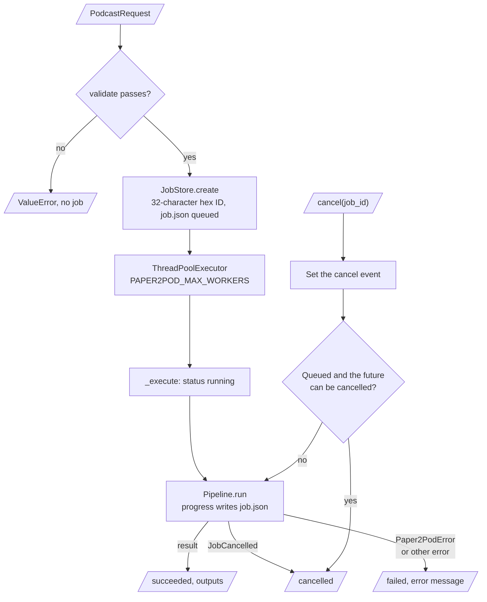

**Procedure** (`JobRunner` and `JobStore` in `jobs.py`)

1. `submit()` validates the request. An invalid request never gets a job.
2. `submit()` makes the job (status `queued`) and gives it to a thread pool with `PAPER2POD_MAX_WORKERS` threads.
3. The thread sets the status to `running` and calls `Pipeline.run()`.
4. Each progress call writes the stage, the percent and the message to `job.json`.
5. At the end, the thread sets the status to `succeeded` and records the outputs.
6. `cancel()` sets a cancel flag. A queued job becomes `cancelled` at once. A running job stops at its next check.

**Job status values**

| Status | Meaning | Final? |
|---|---|---|
| `queued` | The job waits for a free thread | No |
| `running` | The pipeline works on the job | No |
| `succeeded` | All 7 stages finished. The outputs are in the job directory | Yes |
| `failed` | An error stopped the job. The `error` field has the message | Yes |
| `cancelled` | A cancel request stopped the job | Yes |

**Rules**

- A `JobCancelled` error gives `cancelled`. A `Paper2PodError` gives `failed`. Any other error also gives `failed`, with the error type in the message.
- `JobStore` writes `job.json` to a `.tmp` file first and then renames it.
- `JobStore.get()` returns a copy. It reads `job.json` from the disk if the job is not in memory.

---

## 13. The front-ends

### 13.1 The CLI

**Purpose.** Run paper2pod from a terminal (`cli.py`).

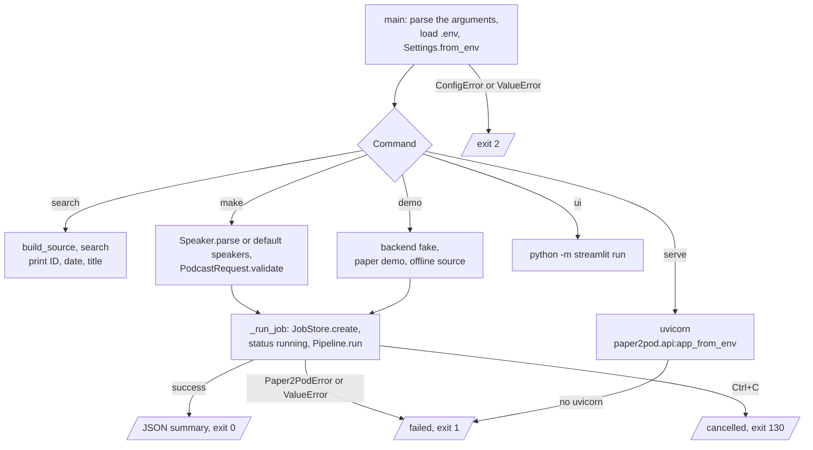

| Command | Options | What it does |
|---|---|---|
| `paper2pod search <query>` | `-n` (default `5`) | Search arXiv and print the ID, the date and the title of each paper |
| `paper2pod make <paper>` | `--minutes` (default `10`), `--speaker` (repeatable), `--backend {openai,fake}`, `--mp3` | Make a podcast from a paper reference |
| `paper2pod demo` | `--minutes` (default `3`) | Make a podcast from the sample paper with the fake backend, offline |
| `paper2pod serve` | `--host` (default `127.0.0.1`), `--port` (default `8000`) | Start the HTTP API with uvicorn |
| `paper2pod ui` | none | Start the Streamlit UI |

The global option `--data-dir` sets the data folder for all commands. A speaker has the form
`Name[:role[:style[:voice]]]`, for example `--speaker Alex:host:female`. If you give no speaker, paper2pod
uses `Alex:host:female` and `Sam:expert:male`.

**Procedure** (`make` and `demo`)

1. Load `.env` if the file exists and python-dotenv is installed. Read the settings.
2. Validate the request. Build the adapters.
3. Make the job, set it to `running` and print the job directory.
4. Run the pipeline in the same process. Print one line for each progress event.
5. Print a JSON summary: `audio`, `script_words`, `target_words`, `audio_minutes`, `grounding_score`, `format_issues`.

**Exit codes**

| Code | Meaning |
|---|---|
| `0` | The job succeeded |
| `1` | The job failed (`Paper2PodError` or `ValueError`), a search failed, an optional extra is missing, or uvicorn is not installed |
| `2` | The settings or the request are not valid |
| `130` | The user pressed Ctrl+C. The job is `cancelled` |

### 13.2 The HTTP API

**Purpose.** Give the job runner to other programs over HTTP (`api.py`, `[api]` extra).

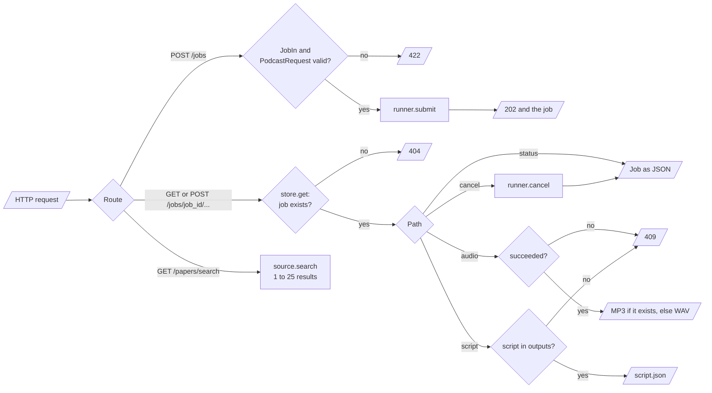

| Method and route | Result |
|---|---|
| `GET /health` | `{"status": "ok", "backend": ...}` |
| `POST /jobs` | Submit a job. Returns `202` and the job |
| `GET /jobs/{job_id}` | The job: status, stage, progress, message, error, outputs |
| `POST /jobs/{job_id}/cancel` | Ask for a cancel. Returns the job |
| `GET /jobs/{job_id}/audio` | The MP3 file if it exists, else the WAV file. `409` if the job did not succeed |
| `GET /jobs/{job_id}/script` | The script as JSON. `409` if the script is not ready |
| `GET /papers/search?q=...&max_results=...` | A list of papers. `q` has 2 to 300 characters, `max_results` is 1 to 25 |

**Rules**

- The request body of `POST /jobs` has `paper` (1 to 200 characters), `minutes` (2 to 60), `speakers` and `export_mp3`.
- A speaker has `name` (1 to 40 characters), `role`, `voice_style` and an optional `voice`.
- An invalid body gives `422`. An unknown or malformed job ID gives `404`.
- The interactive API documentation is at `http://127.0.0.1:8000/docs`.

### 13.3 The Streamlit UI

**Purpose.** Search papers, start jobs and listen to the result in a browser (`ui/streamlit_app.py`, `[ui]` extra).

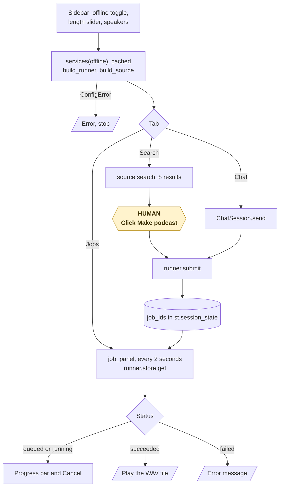

1. Use the sidebar toggle to select the offline demo or the real backend.
2. Set the length with the slider (2 to 30 minutes, default 10).
3. Write one speaker on each line, in the form `name:role:style[:voice]`.
4. In the **Search** tab, search arXiv (8 results) and click **Make podcast**.
5. In the **Chat** tab, write requests in plain English.
6. In the **Jobs** tab, follow the progress. The panel refreshes each 2 seconds. Cancel a job or play the finished WAV file.

Each browser session keeps its own job list and its own chat session in `st.session_state`.

### 13.4 The chat session

**Purpose.** Change short English requests into searches and jobs (`chat.py`).

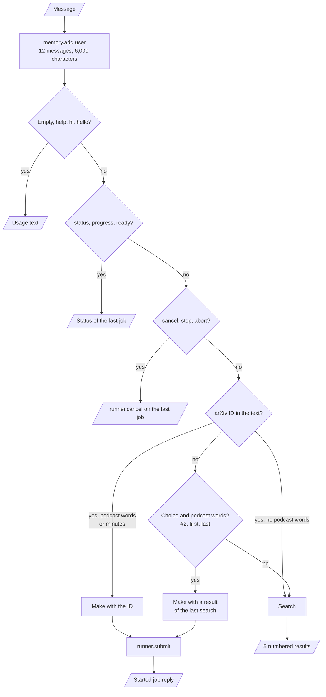

| Intent | Example request | Action |
|---|---|---|
| `help` | `help`, `hi`, an empty message | Show the usage text |
| `status` | `status`, `is it ready?` | Show the status of the last job |
| `cancel` | `cancel`, `stop` | Cancel the last job |
| `search` | `find papers on graph transformers` | Search and show 5 numbered results |
| `make` | `make a 10 minute podcast of #2`, `podcast 1706.03762, 15 minutes` | Submit a job for a result or an arXiv ID |

**Rules**

- `parse_intent()` uses regular expressions. It does not use an LLM.
- The memory keeps at most 12 messages and at most 6,000 characters. It stores each message once, as a structured message.
- Each `ChatSession` has its own memory and its own job list. There is no module-level memory.
- If a request fails, the reply starts with `Sorry, that failed:`. The chat session never raises an error.

---

## 14. The length control and the safety model

**Length control values** (from `config.py`, `script/budget.py` and `quality/`)

| Value | Default or constant | Where |
|---|---|---|
| Words per minute | `150` (permitted `80` to `250`) | `PAPER2POD_WORDS_PER_MINUTE` |
| Tolerance for each segment | `0.12` (permitted `0.02` to `0.5`) | `PAPER2POD_LENGTH_TOLERANCE` |
| Maximum words in one segment | `650` (permitted `150` to `1500`) | `PAPER2POD_MAX_SEGMENT_WORDS` |
| Regenerations for each segment | `2` (permitted `0` to `5`) | `PAPER2POD_MAX_REGENERATIONS` |
| Opening share and wrap-up share | 8 % and 7 %, minimum 40 words each | `INTRO_SHARE`, `OUTRO_SHARE` |
| Body words for each outline item | at least 80 | `plan_segments()` |
| Tokens for each word | `1.45 × 1.6` headroom, plus 250 JSON tokens | `TOKENS_PER_WORD`, `TOKEN_HEADROOM`, `JSON_OVERHEAD_TOKENS` |
| Token limit for one call | `16000` | `MODEL_OUTPUT_LIMIT` |
| Token limit growth after truncation | × 1.5 | `ScriptWriter.write_segment()` |

**Request limits** (`PodcastRequest.validate()`)

| Rule | Limit |
|---|---|
| Length | 2 to 60 minutes |
| Speakers | 2 to 4, unique names (case is ignored) |
| Roles | `host`, `expert`, `guest` |
| Voice styles | `male`, `female`, `neutral`, `any` |

**Format rules** (`quality/format.py`)

| Issue | Rule |
|---|---|
| Monologue | A turn has more than 180 words |
| Same speaker | One speaker has more than 2 turns in a row |
| Markup | The text contains `**`, `__`, a markdown heading or a bracketed lowercase cue |
| Speaker label | The text starts with `Name:` |
| Silent speaker | A speaker has no turn |
| Unknown speaker or empty text | A turn names an unknown speaker or has no text |

**Safety rules**

| Rule | How the code enforces it |
|---|---|
| No path traversal | `JobStore.workdir()` accepts only `^[0-9a-f]{32}$` |
| No secret in logs or `repr` | `openai_api_key` has `repr=False`. The code does not log the key, the paper text or the script text |
| No invalid script | `parse_turns()` refuses unknown speakers, empty lists and non-object turns |
| No partial file | paper2pod writes PDF, PCM and `job.json` files to a temporary file first, then renames it |
| Polite arXiv access | 3-second minimum interval, a user agent and a bounded retry count |
| No silent truncation | `finish_reason == "length"` causes a retry with a larger token limit |

---

## 15. Data and file map

| Path | Committed? | Contents |
|---|---|---|
| `data/jobs/<job_id>/job.json` | No (git ignores `data/`) | The job: request, status, stage, progress, message, error, outputs, times |
| `data/jobs/<job_id>/paper.json` | No | The paper metadata |
| `data/jobs/<job_id>/paper.pdf` | No | A copy of the PDF (arXiv papers only) |
| `data/jobs/<job_id>/sections.json` | No | The title and word count of each section |
| `data/jobs/<job_id>/outline.json` | No | The outline items |
| `data/jobs/<job_id>/script.json` | No | The script: title, speakers, turns, segment titles |
| `data/jobs/<job_id>/podcast.wav` | No | The podcast |
| `data/jobs/<job_id>/podcast.mp3` | No | The podcast as MP3, only with `--mp3` or `export_mp3` |
| `data/jobs/<job_id>/chapters.json` | No | The title and start second of each segment |
| `data/jobs/<job_id>/metrics.json` | No | `paper`, `models`, `voices`, `length`, `segments`, `format_issues`, `grounding`, `readability`, `usage`, `timings_seconds` |
| `data/cache/meta/<id>.json` | No | Cached arXiv metadata (a `/` in the ID becomes `_`) |
| `data/cache/pdf/<id>.pdf` | No | Cached PDF files |
| `data/cache/tts/<sha256>.pcm` | No | Cached TTS audio for each chunk |
| `.env` | No (git ignores it) | Your local settings and credentials |
| `.env.example` | Yes | The 15 variable names, with empty values |
| `src/paper2pod/prompts/*.txt` | Yes | The 4 prompt templates |
| `src/paper2pod/demo/sample_paper.txt` | Yes | The fictional sample paper |

The `.gitignore` file also ignores `*.pdf`, `*.wav`, `*.mp3`, `*.log`, `downloads/` and `output/`.

---

## 16. How to run paper2pod

### 16.1 Prerequisites

| Need | For |
|---|---|
| Python 3.10+ | All components (CI uses Python 3.11) |
| An OpenAI API key | The `openai` backend only |
| Network access to `export.arxiv.org` and `arxiv.org` | `make`, `search` and the real UI mode |
| FFmpeg on `PATH` | MP3 export only |

### 16.2 Installation

```bash
git clone https://github.com/KrishnaAnnavaram/paper2pod.git
cd paper2pod
python -m venv .venv
. .venv/bin/activate            # Windows: .venv\Scripts\activate
pip install -e ".[dev]"
```

The optional extras are in `pyproject.toml`:

| Extra | Installs | For |
|---|---|---|
| `openai` | `openai>=1.40` | The OpenAI LLM and TTS adapters |
| `pdf` | `pymupdf>=1.24` | PDF extraction with column sequence |
| `pdf-lite` | `pypdf>=4.0` | PDF extraction without column sequence |
| `mp3` | `pydub>=0.25` | MP3 export (FFmpeg also necessary) |
| `fast` | `numpy>=1.26` | Faster loudness calculation |
| `api` | `fastapi`, `uvicorn`, `pydantic` | `paper2pod serve` |
| `ui` | `streamlit>=1.37` | `paper2pod ui` |
| `dotenv` | `python-dotenv>=1.0` | `.env` file loading |
| `all` | All of the above | Everything |
| `dev` | `pytest`, `fastapi`, `httpx`, `pydantic`, `ruff` | The tests |

### 16.3 Run paper2pod

Run the offline demo first. It needs no key and no network:

```bash
paper2pod demo --minutes 3
# job <id> -> data/jobs/<id>
# [  0%] fetch    Looking up the paper
# ...
# [100%] done     Done: 3.19 minutes of audio
```

Make a podcast from a real paper:

```bash
pip install -e ".[openai,pdf,dotenv]"
cp .env.example .env            # set PAPER2POD_BACKEND=openai and OPENAI_API_KEY
paper2pod search "attention is all you need"
paper2pod make 1706.03762 --minutes 10 --speaker Alex:host:female --speaker Sam:expert:male
```

Test the arXiv download and the PDF parser without an API key:

```bash
paper2pod make 1706.03762 --minutes 5 --backend fake
```

Start the HTTP API and the UI:

```bash
pip install -e ".[api,ui]"
paper2pod serve                 # http://127.0.0.1:8000/docs
paper2pod ui                    # Streamlit
```

Run the tests:

```bash
pytest -q
```

### 16.4 Environment variables

| Variable | Used by | Meaning |
|---|---|---|
| `PAPER2POD_BACKEND` | Adapter factory | `openai` or `fake`. Default `openai`. Any other value is an error |
| `OPENAI_API_KEY` | `OpenAILLM`, `OpenAITTS` | Necessary only for the `openai` backend. paper2pod never logs it |
| `OPENAI_BASE_URL` | `OpenAILLM`, `OpenAITTS` | Optional OpenAI-compatible endpoint. Default: the OpenAI API |
| `PAPER2POD_LLM_MODEL` | `OpenAILLM` | The chat model. Default `gpt-4o-mini` |
| `PAPER2POD_TTS_MODEL` | `OpenAITTS` | The speech model. Default `tts-1` |
| `PAPER2POD_WORDS_PER_MINUTE` | Budget planner, `FakeTTS`, length check | Speech rate. Default `150`, permitted `80` to `250` |
| `PAPER2POD_LENGTH_TOLERANCE` | Script writer, length check | Relative range for each segment. Default `0.12`, permitted `0.02` to `0.5` |
| `PAPER2POD_MAX_SEGMENT_WORDS` | Budget planner | Longest segment in one LLM call. Default `650`, permitted `150` to `1500` |
| `PAPER2POD_MAX_REGENERATIONS` | Script writer | Extra attempts for each segment. Default `2`, permitted `0` to `5` |
| `PAPER2POD_MAX_RETRIES` | arXiv client, `OpenAILLM`, `OpenAITTS` | Attempts for transient errors. Default `3`, permitted `1` to `10` |
| `PAPER2POD_DATA_DIR` | Job store, caches | Data folder. Default `data`. The CLI option `--data-dir` overrides it |
| `PAPER2POD_VOICES` | Voice assignment | Voice overrides, for example `Alex:nova,Sam:onyx`. Default: none |
| `PAPER2POD_PAUSE_MS` | Mix stage | Pause between turns in milliseconds. Default `300`, permitted `0` to `3000` |
| `PAPER2POD_MAX_WORKERS` | Job runner | Number of parallel jobs. Default `2`, permitted `1` to `16` |
| `PAPER2POD_LOG_LEVEL` | Logging | Python log level. Default `INFO`. An unknown level gives `INFO` |

A value outside its permitted range causes a `ConfigError`, and the CLI exits with code `2`. An empty
value uses the default.

Credentials are only in a local `.env` file. Git ignores this file. Do not print or commit credentials.

---

## 17. How to extend paper2pod

| You want to… | Do this | Code change? |
|---|---|---|
| Use a different OpenAI chat model | Set `PAPER2POD_LLM_MODEL` | No |
| Use an OpenAI-compatible server | Set `OPENAI_BASE_URL`. The server must support strict JSON-schema output and the voice names | No |
| Change the voice of a speaker | Set `PAPER2POD_VOICES` or give `--speaker Name:role:style:voice` | No |
| Change the speech rate or the pauses | Set `PAPER2POD_WORDS_PER_MINUTE` or `PAPER2POD_PAUSE_MS` | No |
| Change the prompts | Edit `src/paper2pod/prompts/*.txt`. Keep the `$name` placeholders | Small |
| Add an LLM provider | Write a class with `name` and `complete_json(task, system, user, schema, max_tokens)`. Add it to `services/factory.py` and `BACKENDS` | Yes |
| Add a TTS provider | Write a class with `name`, `sample_rate`, `max_chars` and `synthesize(text, voice)` that returns PCM16 mono. Add its voices to a catalog | Yes |
| Add a paper source | Write a class with `search()`, `resolve()` and `fetch_fulltext()` (`sources/base.py`). Add it to `build_source()` | Yes |
| Add a quality check | Add a function to `quality/` and add its result to `metrics` in `pipeline.py` | Small |
| Add a front-end | Use `build_runner()` from `runtime.py`, then `submit()`, `store.get()` and `cancel()` | Yes |

---

## 18. Validation results

| Validation | Result | Command |
|---|---|---|
| Unit and end-to-end tests (local, with `fastapi` and `httpx`) | **92 passed** | `pytest -q` |
| Unit and end-to-end tests in CI (Python 3.11, `.[dev]`) | **92 passed** | `.github/workflows/ci.yml` |
| Offline demo, 2 minutes | 300 of 300 words, 2.13 minutes of audio, grounding `1.0`, 0 format issues | `paper2pod demo --minutes 2` |
| Offline demo, 3 minutes | 450 of 450 words, 3.19 minutes of audio, grounding `1.0`, 0 format issues | `paper2pod demo --minutes 3` |
| Offline demo, 10 minutes | 1,498 of 1,500 words, 10.54 minutes of audio, grounding `1.0`, 0 format issues | `paper2pod demo --minutes 10` |
| Offline demo, 30 minutes | 4,498 of 4,500 words, 31.66 minutes of audio, 10 segments, 326 turns | `paper2pod demo --minutes 30` |
| Request limit | `minutes=61` gives `error: minutes must be between 2 and 60` and exit code `2` | `paper2pod demo --minutes 61` |
| Settings check | `PAPER2POD_BACKEND=bogus` gives a `ConfigError` and exit code `2` | `paper2pod demo` |

The tests cover the arXiv ID formats, the Atom parser, the cache and the retries with a fake HTTP
function. They cover the heading detector, the back matter removal and the column sequence. They also
cover the word budgets, the regeneration, the truncation retry and the trim with a scripted LLM. Other
tests cover voice assignment, loudness, chunks, the job runner, cancel, the HTTP API and the chat session.

The demo numbers prove that the length control works when the LLM obeys the word budget. They do not
prove the quality of a real OpenAI script. `FakeLLM` copies sentences from its notes, so its grounding
score is always `1.0`. The measured audio is 5 % to 7 % longer than the target because the word budget
does not include the pauses.

---

## 19. Known problems

Read these problems before you use paper2pod in production.

| # | Area | Problem | Impact and action |
|---|---|---|---|
| 1 | Accuracy | The grounding check is lexical. It finds invented numbers and acronyms, but not a wrong paraphrase | A confident script can be wrong. Listen to the podcast and compare important claims with the paper |
| 2 | Quality gate | The validate stage only records issues. A job with format issues or a low grounding score still succeeds | Read `metrics.json` before you publish a podcast |
| 3 | Length | The word budget does not include the pauses. A real TTS voice does not speak at exactly 150 words per minute | The demo audio is 5 % to 7 % too long. Adjust `PAPER2POD_WORDS_PER_MINUTE` or `PAPER2POD_PAUSE_MS` |
| 4 | Jobs | The job runner is a thread pool in one process. `JobStore.list()` shows only the jobs of that process | After a restart, a queued or running job stays in that status in `job.json`. Use one process, and start the job again |
| 5 | HTTP API | The API has no authentication and no rate limit | Keep the default host `127.0.0.1`. Do not expose the API without a proxy that does authentication |
| 6 | Copyright | Many arXiv licences do not permit derivative works | Get permission from the authors before you publish a podcast, and credit the paper |
| 7 | Synthetic voices | All voices are synthetic | Label a published podcast as AI-generated. Do not make voices that copy real people |
| 8 | Voices | The voice catalog has only the 6 OpenAI voices. The voice styles are approximate | A compatible server must accept these voice names. Use `PAPER2POD_VOICES` to change a voice |
| 9 | Parsing | The heading detector uses rules. A scanned PDF has no text layer, and paper2pod has no OCR | If no section is found, the outline uses only the abstract. Install `[pdf]`, not only `[pdf-lite]` |
| 10 | Cache | The caches in `data/cache/` grow without limit. The metadata cache never expires | Delete `data/cache/` manually to free space or to get a new paper version |
| 11 | Chat | The chat intents use regular expressions. For example, "ready" always means `status` | Use the search and job panels for exact control |
| 12 | Streamlit UI | The UI slider stops at 30 minutes. The CLI and the HTTP API accept 60 minutes | Use the CLI or the HTTP API for a podcast longer than 30 minutes |
| 13 | Cost | The 30-minute demo made 13 LLM calls and one TTS call for each of its 326 turns. A real paper can need more LLM calls (up to 8 outline items, plus regenerations) | Check `usage` in `metrics.json`. Try a short podcast first |
| 14 | Offline demo | `FakeTTS` writes tones, not speech. `paper2pod search` always uses the network | Use the demo to test the pipeline, not to judge the audio |

---

## 20. Key points

1. **The pipeline is plain functions with injected adapters.** Each stage is testable offline, and the fake backend runs the full pipeline.
2. **The length comes from a word budget.** Each segment has its own budget, token limit, regeneration loop and trim step.
3. **The script is structured data.** Strict JSON turns keep delivery hints out of the spoken text and refuse unknown speakers.
4. **Each job is isolated.** One job directory holds all files of one job, and the job ID cannot leave the jobs folder.
5. **The quality report is honest about its limits.** The grounding score finds invented numbers and acronyms. It does not prove that the script is correct.

---

## 21. Glossary

| Term | Meaning |
|---|---|
| **Adapter** | A class that hides one external service behind a small interface (LLM, TTS engine or paper source) |
| **Backend** | The adapter family: `openai` (real services) or `fake` (offline and deterministic) |
| **Back matter** | The references, bibliography, acknowledgements, appendices, supplementary material and checklist of a paper |
| **Chapter** | The title and start second of one segment in the podcast |
| **Chunk** | A part of a text that fits one LLM call (12,000 characters) or one TTS call (4,000 characters) |
| **Clip** | The PCM audio of one turn |
| **Cue** | A bracketed delivery hint in the LLM text, for example `[laughs]` |
| **Direction** | The delivery hint field of a turn. paper2pod does not speak it |
| **Front-end** | The CLI, the HTTP API, the Streamlit UI or the chat session |
| **Grounding score** | The fraction of checked sentences whose numbers and acronyms all occur in the paper |
| **Intent** | The kind of chat request: `help`, `status`, `cancel`, `search` or `make` |
| **Job** | One request to make one podcast, with a status and outputs |
| **Job directory** | The folder `data/jobs/<job_id>/` with all files of one job |
| **Job runner** | The thread pool that runs jobs in the background |
| **Job store** | The registry of jobs, with one `job.json` file for each job |
| **LLM** | The chat language model that summarizes the sections and writes the segments |
| **Metrics file** | The quality report `metrics.json` of one job |
| **Outline item** | One group of sections with a summary, key points and a weight |
| **Paper reference** | An arXiv ID, a versioned arXiv ID or an arXiv URL |
| **Paper source** | The adapter that searches, resolves and fetches papers |
| **Podcast** | The final audio file of one job |
| **Regenerate** | Send a segment request to the LLM again, with feedback about the last answer |
| **Sample paper** | The fictional paper that the offline demo uses |
| **Script** | The full dialogue of one podcast |
| **Segment** | One part of the script that the LLM writes in one call |
| **Stage** | One of the 7 pipeline steps: `fetch`, `parse`, `outline`, `script`, `validate`, `tts`, `mix` |
| **Tolerance** | The permitted relative difference between the word count and the word budget |
| **TTS engine** | The adapter that changes text into PCM audio |
| **Turn** | One spoken contribution of one speaker |
| **Voice catalog** | The 6 OpenAI voices and their voice styles |
| **Voice style** | The approximate sound of a voice: `male`, `female`, `neutral` or `any` |
| **Weight** | The square root of the word count of an outline item |
| **Word budget** | The number of words that a podcast or a segment must have |

---

## 22. License

[MIT](LICENSE) © 2026 Krishna Annavaram
