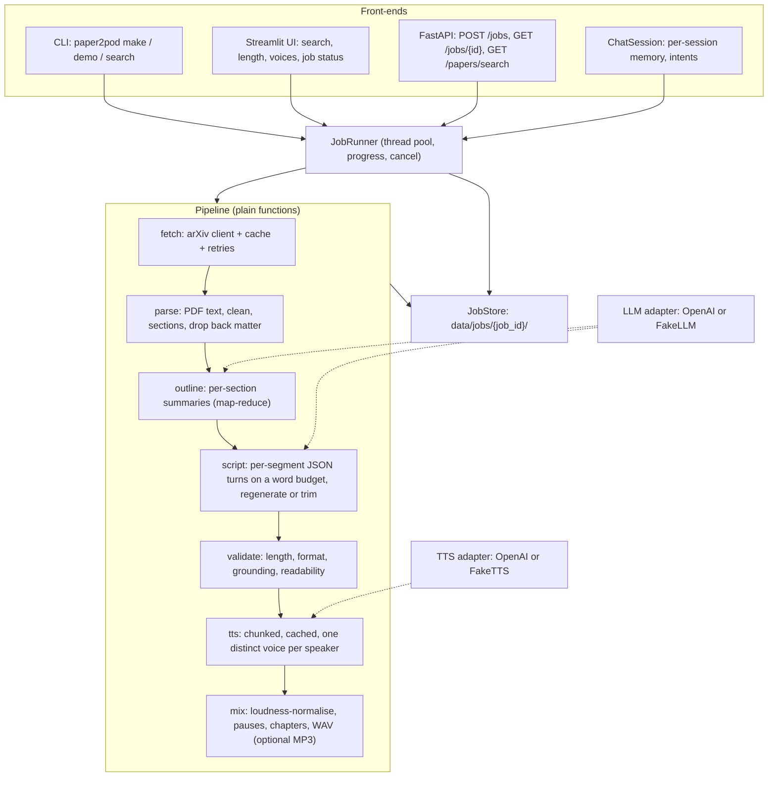

# paper2pod

Turn arXiv papers into multi-voice podcasts with AI agents: search a paper, pick a length and a cast, and get a structured, length-controlled dialogue voiced by distinct TTS voices, plus a quality report.

[](https://github.com/KrishnaAnnavaram/paper2pod/actions/workflows/ci.yml)


## Features

- **arXiv in, audio out.** Search by text, arXiv ID or URL. Metadata and PDFs are cached, and requests are rate-limited and retried.
- **Section-aware content.** Layout-aware PDF extraction (two-column ordering) and a heading detector that understands numbered headings (`3.2 Pruning Rule`, `IV. RESULTS`). References and appendices are dropped. Every section is summarised (map-reduce), so the script isn't built from just the first N characters.
- **Length you can rely on.** The target duration becomes a word budget that is split across segments. Each segment is generated with its own token limit, checked against its budget, regenerated with feedback when it misses, and trimmed at a sentence boundary when it runs long. The final WAV duration is measured and reported.
- **Structured scripts.** The model returns JSON turns `{speaker, text, direction}` through strict JSON-schema output. Delivery cues live in `direction`, so nothing is regex-stripped from the spoken text. "(BERT)" stays in.
- **Correct, distinct voices.** An explicit voice catalog with a deterministic speaker-to-voice assignment that matches style, never reuses a voice, and can be overridden.
- **Quality report per episode.** `metrics.json` holds the length check, per-segment budgets and attempts, format issues, a grounding score (numbers and acronyms in the script vs. the paper), readability, token usage and stage timings.
- **Jobs, not blocking calls.** Every request is a background job with its own working directory, progress polling and cancellation, available from the CLI, a FastAPI service, a Streamlit UI and a small chat front-end.
- **Offline demo.** `paper2pod demo` runs the whole pipeline on a bundled synthetic paper with deterministic fake LLM and TTS adapters. It needs no keys and no network.

## Architecture



## Quickstart

```bash
python -m venv .venv && . .venv/Scripts/activate     # Windows; use .venv/bin/activate on Linux/macOS
pip install -e ".[dev]"                             # core + tests (the core has no third-party deps)

# 1. Offline demo: no API key, no network
paper2pod demo --minutes 3                          # writes data/jobs/<id>/podcast.wav + metrics.json

# 2. Real papers
pip install -e ".[openai,pdf,dotenv]"
cp .env.example .env                                # set PAPER2POD_BACKEND=openai and OPENAI_API_KEY
paper2pod search "attention is all you need"
paper2pod make 1706.03762 --minutes 10 --speaker Alex:host:female --speaker Sam:expert:male

# 3. Service and UI
pip install -e ".[api,ui]"
paper2pod serve                                     # http://127.0.0.1:8000/docs
paper2pod ui                                        # Streamlit
```

Other extras: `[mp3]` for MP3 export (pydub, needs FFmpeg on `PATH`), `[fast]` for numpy-accelerated mixing, `[pdf-lite]` for pypdf instead of PyMuPDF, and `[all]` for everything.

## Configuration

All settings are environment variables. They can also go in a `.env` file, which is optional, git-ignored and loaded only when python-dotenv is installed.

| Variable | Default | Meaning |
|---|---|---|
| `PAPER2POD_BACKEND` | `openai` | `openai` or `fake` (deterministic offline adapters) |
| `OPENAI_API_KEY` | none | Needed only for the `openai` backend; never logged |
| `OPENAI_BASE_URL` | none | Optional OpenAI-compatible endpoint |
| `PAPER2POD_LLM_MODEL` | `gpt-4o-mini` | Chat model for outlines and scripts |
| `PAPER2POD_TTS_MODEL` | `tts-1` | Speech model |
| `PAPER2POD_WORDS_PER_MINUTE` | `150` | Speaking rate used for word budgets |
| `PAPER2POD_LENGTH_TOLERANCE` | `0.12` | Allowed relative deviation per segment |
| `PAPER2POD_MAX_SEGMENT_WORDS` | `650` | Longest segment generated in one call |
| `PAPER2POD_MAX_REGENERATIONS` | `2` | Extra attempts when a segment misses its budget or is invalid |
| `PAPER2POD_MAX_RETRIES` | `3` | Attempts for transient arXiv, LLM and TTS errors (exponential backoff) |
| `PAPER2POD_DATA_DIR` | `data` | Jobs (`data/jobs`) and caches (`data/cache`) |
| `PAPER2POD_VOICES` | none | Voice overrides, e.g. `Alex:nova,Sam:onyx` |
| `PAPER2POD_PAUSE_MS` | `300` | Pause between turns (doubled between segments) |
| `PAPER2POD_MAX_WORKERS` | `2` | Concurrent background jobs |
| `PAPER2POD_LOG_LEVEL` | `INFO` | Logging level (logs never contain paper or script text) |

## Project structure

```
src/paper2pod/
  config.py            Settings from env (.env optional), validation, no secrets in repr
  models.py            Paper, Section, Speaker, Turn, Script, PodcastRequest
  sources/             arxiv.py (IDs, Atom parsing, cache, rate limit), local.py (offline sample)
  parsing/             pdf.py (PyMuPDF/pypdf, column order), cleaning.py, sections.py
  script/              outline.py (map-reduce), budget.py (word/token budgets), generate.py, prompts.py
  prompts/             versioned prompt templates (*.txt)
  quality/             length.py, format.py, factuality.py (grounding), readability.py
  audio/               voices.py (catalog + assignment), text.py (TTS chunking), mix.py (WAV, chapters)
  services/            llm.py and tts.py (OpenAI adapters), fakes.py (offline), factory.py
  pipeline.py          fetch -> parse -> outline -> script -> validate -> tts -> mix
  jobs.py              JobStore (per-job dirs) and JobRunner (thread pool, cancel)
  chat.py              conversational front-end with bounded per-session memory
  api.py               FastAPI service
  cli.py               `paper2pod` command
  ui/streamlit_app.py  Streamlit UI
  demo/sample_paper.txt  a short synthetic paper for the offline demo
tests/                 unit tests per module + offline end-to-end tests
```

## How it works

1. **Fetch.** `ArxivClient.resolve()` normalises an ID or URL and reads the Atom API, then caches the metadata and PDF under `data/cache/`. A search query that contains an arXiv ID resolves that paper directly.
2. **Parse.** Text is extracted with PyMuPDF. Blocks are reordered column by column, ligatures and hyphenation are repaired, page numbers and the arXiv stamp are dropped, and the text is split at detected headings. Everything from *References* onward, plus acknowledgements and appendices, is removed.
3. **Outline.** Sections are merged into at most 8 parts. Each part (chunked if long) is summarised into a summary plus key points. Weights grow with the square root of section length.
4. **Script.** The duration becomes `minutes × wpm` words: about 8% for the opening, 7% for the wrap-up, and the rest spread across outline parts. Long parts are split so that no call exceeds `PAPER2POD_MAX_SEGMENT_WORDS`. Each segment call has a `max_tokens` limit sized for its budget. Truncated or invalid responses are retried with feedback, segments outside the tolerance are regenerated, and overlong output is trimmed.
5. **Validate.** Format checks (unknown speakers, markup, monologues, the same speaker three or more times in a row), grounding (every number and acronym must appear in the paper) and Flesch readability.
6. **TTS.** Each turn is split into chunks of up to 4,000 characters at sentence boundaries and synthesised as raw PCM with the speaker's voice. Audio is cached by `(engine, voice, text)`.
7. **Mix.** Clips are normalised to −20 dBFS RMS with a peak ceiling, joined with pauses, and written as WAV. One chapter per segment goes into `chapters.json`. The measured duration goes into `metrics.json`.

## Testing

```bash
pip install -e ".[dev]"
pytest -q
```

The tests need no network and no API keys. The arXiv client gets a fake HTTP function, script generation uses a scripted LLM, and end-to-end runs use `FakeLLM` and `FakeTTS`. Most tests target a specific failure mode of an earlier prototype, including tool-to-tool calls, truncated long scripts, unchecked duration, parenthetical content being deleted, a wrong voice map, shared global output and memory, history injected twice, hard-wired model and `.env` handling, weak section parsing, no quality checks and blocking UI work. The API tests are skipped when FastAPI isn't installed. CI runs `pytest` on Python 3.11 for every push.

## Roadmap

- [x] **M1:** pure-function pipeline with a CLI (`paper2pod make 1706.03762 --minutes 10`)
- [x] **M2:** structured JSON script and length control (budgets, regeneration, trimming, measured duration)
- [x] **M3:** TTS chunking, voice assignment, loudness-normalised mixing and chapters, with tests
- [x] **M4:** background job runner, FastAPI service and Streamlit UI
- [x] **M5:** chat front-end with per-session memory (rule-based intents)
- [ ] **M6:** LLM-judged factual consistency (claim extraction vs. source passages) on top of the lexical grounding check
- [ ] GROBID backend for parsing (figures, equations and references as structured data)
- [ ] Intro/outro music beds and ID3 chapter markers in MP3 export
- [ ] LLM-driven chat agent (tool calls into the job API) and a small human-rated evaluation set
- [ ] Persistent queue (RQ or Celery) for multi-process deployments

## Limitations and responsible use

- **Accuracy.** LLM-written explanations can be wrong even when they sound confident. The grounding score only checks that numbers and acronyms in the script appear in the paper. It can't catch a paraphrase that misstates a result. Listen critically and check important claims against the paper.
- **Copyright.** arXiv papers have their own licences, and many do not allow redistribution of derivative works. Downloaded PDFs, scripts and audio stay in the git-ignored `data/` directory. Get the authors' or licence holder's permission before you publish an episode, and credit the paper.
- **Synthetic voices.** Episodes use AI-generated voices. Label published audio as AI-generated, and don't make voices that imitate real people.
- **Cost.** A 30-minute episode takes roughly 10 to 20 LLM calls and a few hundred TTS requests. Token usage is reported in `metrics.json`.
- **Voice styles** (male, female, neutral) are approximate perceptual labels for the preset voices. Override them freely.

## License

[MIT](LICENSE) © 2026 Krishna Annavaram
